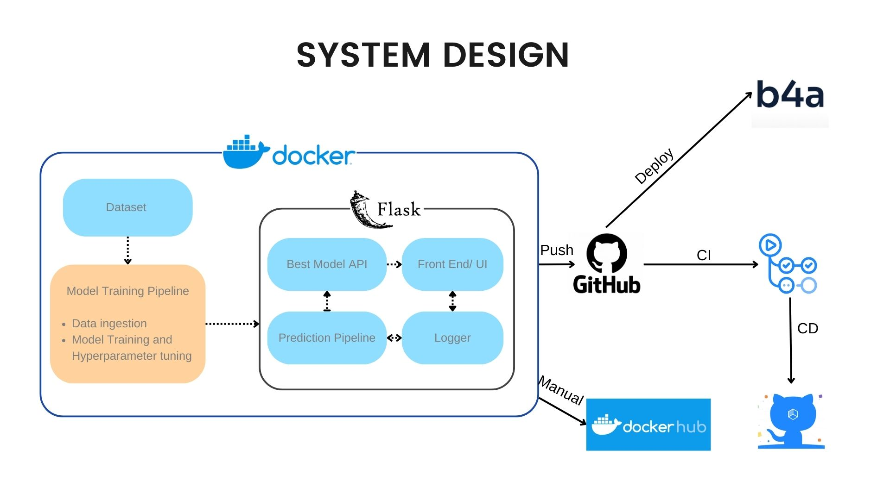

# Firepred

 

> This is a sample application for demonstrating MLOps pipeline.

An intelligent forest fire prediction system that leverages machine learning classifier algorithms, such as logistic regression and random forest, while integrating MLOps principles for efficient and robust model development, deployment, and maintenance.

## Features

- Automatic Deployment using Github Actions.
- Unit Testing using Pytest.
- Static analysis and formatting using black.
- Hyperparameter tuning using optuna.

